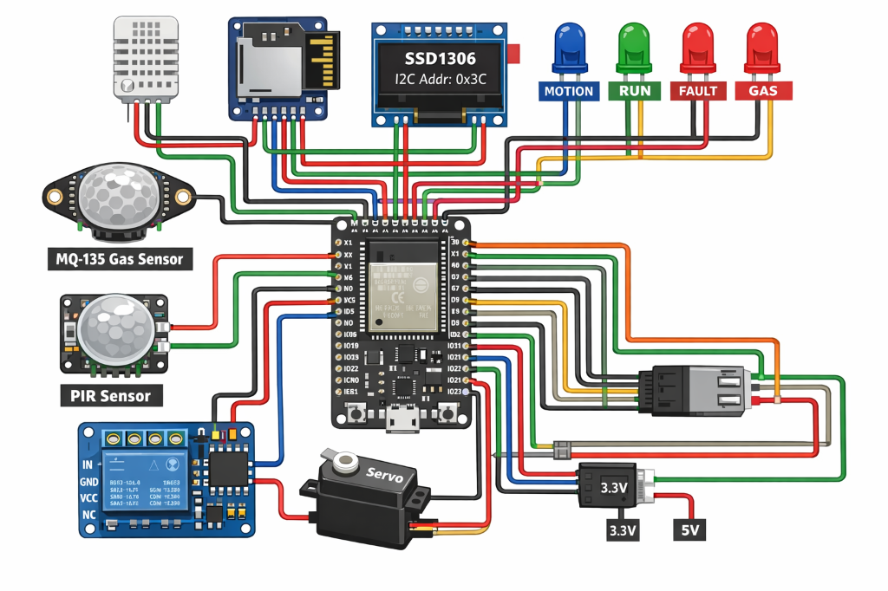

# Sentinel-IIoT-Controller

**Enterprise-Grade Environmental Safety & Monitoring Node**

  

## System Architecture
**Sentinel-IIoT-Controller** is a robust firmware solution designed for the ESP32 microcontroller, engineered for industrial environmental monitoring and automated safety control. This system integrates multi-sensor data acquisition (Temperature, Humidity, Gas, Motion) with autonomous actuator logic to perform critical safety operations in real-time.

### Network Diagram


## Key Features
- **Real-Time Environmental Telemetry**: High-precision monitoring of ambient temperature and relative humidity via DHT22 protocol.
- **Hazardous Gas Detection**: Continuous air quality sampling utilizing MQ-135 sensors independent of network connectivity.
- **Autonomous Safety Interlocks**:
    - **Gas Limit Relay**: Automatic activation of ventilation/cutoff relays upon detecting hazardous gas levels (>2000 ppm).
    - **Motion-Triggered Servo**: Security surveillance integration triggering servo mechanisms upon PIR motion events.
- **Local HMI**: 128x64 OLED display providing immediate operator feedback on system status and sensor values.
- **Data Persistence**: Localized structured data logging to SD Card via VSPI interface for compliance and historical analysis.

## Technical Specifications

### Bill of Materials (BOM)
| Component | Qty | Description | Ref |
| :--- | :--- | :--- | :--- |
| **ESP32 DevKit V1** | 1 | Dual-core Tensilica LX6 MCU @ 240MHz | U1 |
| **DHT22** | 1 | Digital Temp/Humidity Sensor (+Pull-up) | U2 |
| **MQ-135** | 1 | Air Quality/Gas Sensor | U3 |
| **HC-SR501** | 1 | PIR Motion Sensor | U4 |
| **SSD1306** | 1 | 0.96" I2C OLED Display | U5 |
| **Relay Module** | 1 | 5V/10A Optical Isolated Relay | K1 |
| **Servo Motor** | 1 | Micro Servo SG90 | M1 |
| **SD Card Module** | 1 | SPI Interface Adapter | U6 |

### Electrical Characteristics
- **Logic Voltage**: 3.3V (Note: 5V tolerant inputs not guaranteed; level shifters recommended for 5V peripherals).
- **Power Supply**: 5V DC via Micro-USB or VIN pin.
- **Current Draw**: ~150mA (Idle) / ~800mA (Peak with Relay & Servo active).

### Hardware Architecture Map

| Interface | Component | GPIO Pin | Configuration |
| :--- | :--- | :--- | :--- |
| **I2C Bus** | OLED SDA | GPIO 21 | Pull-up |
| **I2C Bus** | OLED SCL | GPIO 22 | Pull-up |
| **Digital In** | DHT22 Sensor | GPIO 4 | Internal Pull-up |
| **Digital In** | PIR Sensor | GPIO 27 | Active High |
| **Analog In** | MQ-135 Gas Sensor| GPIO 34 | ADC1 Channel 6 |
| **Digital Out** | Relay Module | GPIO 25 | Active High |
| **PWM Out** | Servo Control | GPIO 26 | 50Hz Signal |
| **VSPI Bus** | SD Card CS | GPIO 5 | Chip Select |
| **VSPI Bus** | SD Card MOSI | GPIO 23 | Master Out |
| **VSPI Bus** | SD Card MISO | GPIO 19 | Master In |
| **VSPI Bus** | SD Card SCK | GPIO 18 | Clock |
| **Status LED** | Motion Indicator | GPIO 33 | Blue |
| **Status LED** | System Run | GPIO 32 | Green |
| **Status LED** | System Fault | GPIO 17 | Red |
| **Status LED** | Gas Alarm | GPIO 16 | Red |

## Deployment & Build
This project utilizes **PlatformIO** for dependency management and build automation.

### Prerequisites
- VS Code with PlatformIO Extension
- ESP32 Development Board (DevKit V1 recommended)

### Build Instructions
1. Clone the repository.
2. Open the project directory in VS Code.
3. Execute the build command:
   ```bash
   pio run
   ```
4. Upload firmware to target device:
   ```bash
   pio run --target upload
   ```

### Simulation
This firmware is fully compatible with Wokwi. Use the included `diagram.json` to launch a cycle-accurate digital twin of the hardware setup for testing and validation.

## License
This project is licensed under the MIT License - see the [LICENSE](LICENSE) file for details.
